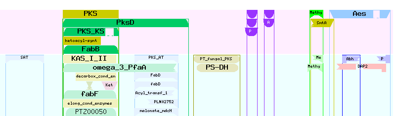
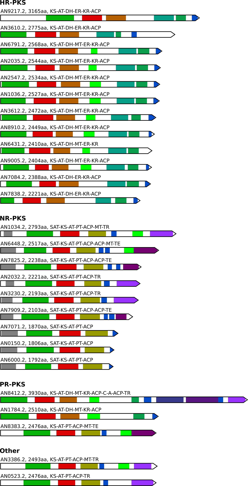

# synthaser
## Process
`synthaser` parses the results of a batch NCBI conserved domain search and determines
the domain architecture of secondary metabolite synthases.

## Usage
```
Usage: synthaser.py [OPTIONS] SYNTHASE RESULTS

  Parse NCBI CD-Search results file to find domain architectures of
  secondary metabolite synthases.

Options:
  -f, --fasta FILENAME  Proteins submitted to CD-search (FASTA)
  -v, --visualise TEXT  Generate .svg visualisation
  -e, --extract TEXT    Extract domain regions from each synthase
  -o, --output TEXT     Base name for output files
  --help                Show this message and exit.
```

Where `results` are a text file downloaded from a CD search run (Target Data: Domain
hits, Data mode: Full, Align format: ASN text), and `fasta` is the FASTA file that
was submitted. The sequence names are assumed identical in both files.

By default, domain architecture are printed to stdout. A base name for output files
can be specified using `output`. Text will be written to `output.txt`, visualisation
to `output.svg`.

If `visualise` is given, the `fasta` argument must be given (used for scaling
by protein length).

## Dependencies
`synthaser` is written for (and only tested on) Python 3.6+. The only external
dependency is `click`, which is used for the command line interface.

## Example
Submitting the amino acid sequence for cichorine to CD search gives the following
result:



Visually, it's easy to see this should be a non-reducing PKS, with the architecture
`SAT-KS-AT-PT-ACP-ACP-cMT-TE`. Programatically, it's not so easy due to the number of
overlapping domains - cue `synthaser`.

Download the results (Domain hits, Data mode: Full, ASN text).

```
#Batch CD-search tool	NIH/NLM/NCBI
#cdsid	QM3-qcdsearch-1E38C39A08C52B9-64D0E079C997D0
#datatype	hitsFull Results
#status	0
#Start time	2019-07-25T02:26:43	Run time	0:00:00:13
#status	success

Query	Hit type	PSSM-ID	From	To	E-Value	Bitscore	Accession	Short name	Incomplete	Superfamily
Q#1 - >cichorine_PKS	specific	238429	381	743	8.40138e-168	523.274	cd00833	PKS	 - 	cl09938
Q#1 - >cichorine_PKS	superfamily	353032	381	743	8.40138e-168	523.274	cl09938	cond_enzymes superfamily	 - 	 - 
Q#1 - >cichorine_PKS	specific	225858	378	1199	8.86544e-166	542.045	COG3321	PksD	 - 	cl09938
Q#1 - >cichorine_PKS	specific	214836	383	745	2.5431e-104	336.223	smart00825	PKS_KS	 - 	cl33401
Q#1 - >cichorine_PKS	superfamily	214836	383	745	2.5431e-104	336.223	cl33401	PKS_KS superfamily	 - 	 - 
...
```

Calling the script:

`python3 synthaser.py pks hitdata.txt`

Will give a tab delimited string:

```
...
NR-PKS
cichorine_PKS   SAT-KS-AT-PT-ACP-ACP-MT-TE
...
```

If you want to visualise the domain architecture, use `--visualise`, supply the FASTA
file with `--fasta` and specify a base name for output files with `--output`.

`python3 synthaser.py pks hitdata.txt --output --fasta fasta.faa --visualise`

Generates:


## Bigger example
Obviously, the main utility for `synthaser` comes when you want to analyse many
synthases at once. For example, running antiSMASH 4.3 on the genome of A. nidulans
FGSC A4 from NCBI generated the final GenBank file `NT_107008.final.gbk`.

Using the provided convenience script `extract_synthases.py` pulls out all synthases
into FASTA files (looks for proteins with `sec_met` qualifiers, then extracts and 
separates files for PKS, NRPS, terpene and hybrid synthases).

`python3 extract_synthases.py NT_107008.final.gbk`

Submit to batch CD-search, download the results and run the script as above.

`python3 synthaser.py pks hitdata.txt`

Which prints to stdout:

```
HR-PKS
AN6791.2   KS-AT-DH-MT-ER-KR-ACP
AN6431.2   KS-AT-DH-MT-ER-KR
AN3610.2   KS-AT-DH-ER-KR-ACP
AN3612.2   KS-AT-DH-MT-ER-KR-ACP
AN9217.2   KS-AT-DH-ER-KR-ACP
AN7838.2   KS-AT-DH-ER-KR-ACP
AN7084.2   KS-AT-DH-ER-KR-ACP
AN8910.2   KS-AT-DH-MT-ER-KR-ACP
AN9005.2   KS-AT-DH-MT-ER-KR-ACP
AN2035.2   KS-AT-DH-MT-ER-KR-ACP
AN2547.2   KS-AT-DH-MT-ER-KR-ACP
AN1036.2   KS-AT-DH-MT-ER-KR-ACP

NR-PKS
AN6000.2   SAT-KS-AT-PT-ACP
AN6448.2   SAT-KS-AT-PT-ACP-ACP-MT-TE
AN7909.2   SAT-KS-AT-PT-ACP-ACP-TE
AN7825.2   SAT-KS-AT-PT-ACP-ACP-TE
AN7071.2   SAT-KS-AT-PT-ACP
AN3230.2   SAT-KS-AT-PT-ACP-TR
AN2032.2   SAT-KS-AT-PT-ACP-TR
AN0150.2   SAT-KS-AT-PT-ACP
AN1034.2   SAT-KS-AT-PT-ACP-MT-TR

PR-PKS
AN1784.2   KS-AT-DH-MT-KR-ACP
AN8412.2   KS-AT-DH-MT-KR-ACP-C-A-ACP-TR

Other
AN3386.2   KS-AT-PT-ACP-MT-TR
AN0523.2   KS-AT-PT-ACP-TR
AN8383.2   KS-AT-PT-ACP-MT-TE
```

This can be visualised using:

`python3 synthaser.py pks hitdata.txt --output pks --fasta pks_list.faa --visualise`

To generate:


