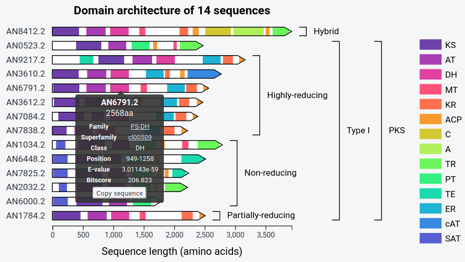

# synthaser
[](https://coveralls.io/github/gamcil/synthaser?branch=master&service=github)
[](https://synthaser.readthedocs.io/en/latest/?badge=latest)
[](https://badge.fury.io/py/synthaser)

## Process
`synthaser` parses the results of a batch NCBI conserved domain search and determines
the domain architecture of secondary metabolite synthases.

## Installation
Install from PyPI using pip:

```sh
$ pip install --user synthaser
```

or clone the repo and install locally:

```sh
$ git clone https://www.github.com/gamcil/synthaser
$ cd synthaser
$ pip install -e .
```

## Dependencies
`synthaser` is written for Python 3.6+ and its only external Python dependency is
`requests`, which is used for querying the NCBI's APIs. To perform local
searches, the programs `RPS-BLAST` as well as the CD-Search post-processing
utility, `rpsbproc`, should be installed (available from ...)

## Usage
A full `synthaser` search can be performed as simply as:

```sh
$ synthaser -qf sequences.fasta
```

Where `sequences.fasta` is a FASTA format file containing the protein sequences
that you would like to search.

For a full listing of available arguments, enter:

```sh
$ synthaser -h
```

### Visualising your results
`synthaser` is capable of generating fully-interactive, annotated visualisations
so you can easily explore your results. All that is required is one
extra argument:

```sh
$ synthaser -qf sequences.fasta -p
```

This will generate a figure like so:



Click here to play around with the full version of this example.

### Saving your search session
`synthaser` allows you to save your search results such that they can be easily
reloaded for further visualisation or exploration without having to fully re-do
the search.

To do this, use the `--json_file` command:

```sh
$ synthaser -qf sequences.fasta --json_file sequences.json
```

This will save all of your results, in JSON format, to the file
`sequences.json`. Then, loading this session back into `synthaser`, is as easy
as:

```sh
$ synthaser --json_file sequences.json ...
```

### Using your own rules
Though `synthaser` was originally designed to analyse secondary metabolite synthases,
it can easily be repurposed to analyse the domain architectures of
any type of protein sequence.

Under the hood, `synthaser` uses two files to determine 1) which domains to save
from a CD-Search run (`domains.json`) and 2) the rules used to classify sequences based on their
domain architectures (`rules.json`). By default, `synthaser` will use the copies
of these files distributed with the program. However, providing your own rules
is as simple as:

```sh
$ synthaser -qf sequences.fasta -df my_domains.json -cf my_rules.json
```

For a detailed explanation of how to create your own `synthaser` rule files,
as well as API 
please refer to the `documentation`.

## Citations
If you found `synthaser` helpful, please cite:

```sh
1. <pending>
```
