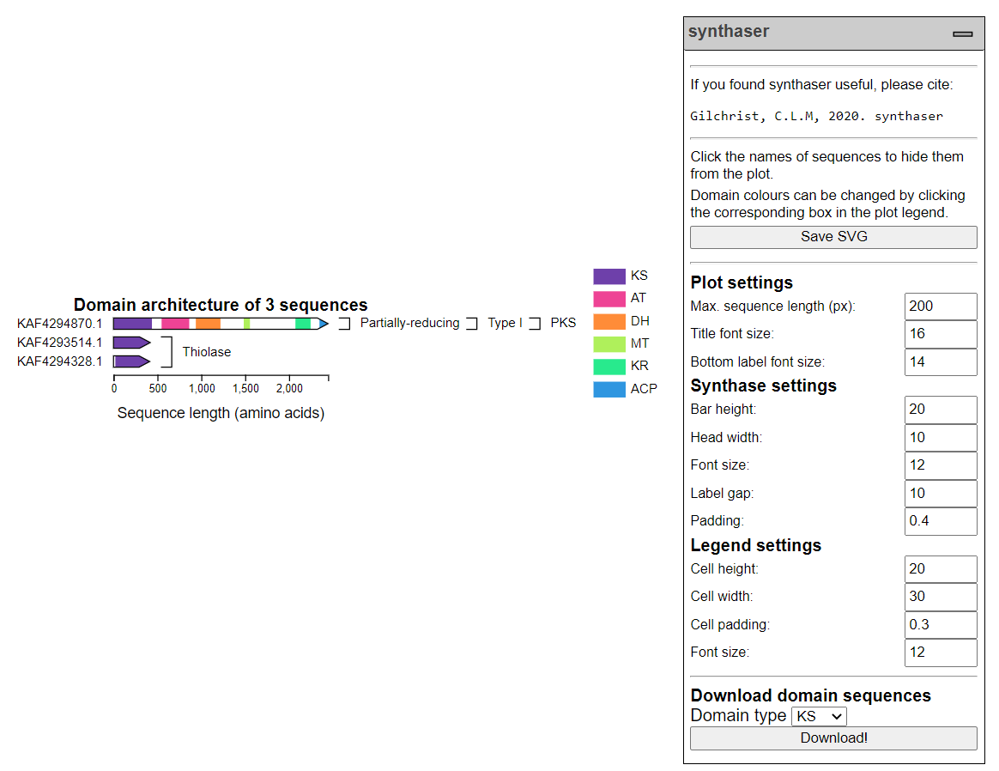
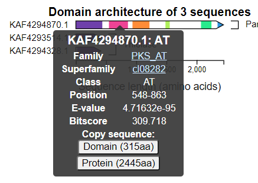

.. _quickstart:

Quickstart
==========

This section of the documentation gives a brief overview of how to get started using
`synthaser` and a broad overview of its features.

.. _running_config:

Pre-search configuration using the ``config`` module
----------------------------------------------------

The NCBI requires that you provide some identification before using their
services in order to prevent abuse. This can be an e-mail address, or more recently,
an API key (https://ncbiinsights.ncbi.nlm.nih.gov/2017/11/02/new-api-keys-for-the-e-utilities/).

You can use the ``config`` module to set these parameters for ``synthaser`` searches (you'll only have to do this once!).
This module will save a file, ``config.ini``, wherever your operating system stores configuration
files (for example, in Linux it will be saved in ~/.local/config/synthaser).
When you run remote searches in ``synthaser``, it will first check to see if it can find
this file, and then if an e-mail address or API key is saved; if they are not found,
``synthaser`` will throw an error.

To set an e-mail address:

::

        $ synthaser config --email "foo@bar.com"

...or an API key:

::

        $ synthaser config --api_key <your API key>

.. _running_search:

Running a synthaser search using the ``search`` module
------------------------------------------------------

Once configured, a synthaser search is as easy as:

``synthaser search --query_file sequences.fasta``

This will take all sequences in ``sequences.fasta`` and start a remote CD-Search run.

.. note::
        Most of the arguments used with synthaser have shorter forms which can be found
        in the help menus (e.g. ``synthaser search --help``). For example, the short version
        of ``--query_file`` here is ``-qf``.

Alternatively, you can use the ``-qi/--query_ids`` argument to start a search using just
a collection of NCBI identifiers. For example:

``synthaser search -qi KAF4294870.1 KAF4294328.1 KAF4293514.1``

This will retrieve each sequence and start a remote CD-Search run.

There are several optional arguments you can use which control the output synthaser will generate.
To generate a synthaser plot of your sequences, add the ``-p/--plot`` argument, optionally
specifying a name to generate a portable HTML file:

``synthaser search -qf sequences.fasta -p <plot.html>``

The plot will then open directly in your web browser.

You can save a file containing the data of a synthaser search by using the ``-json,
--json_file`` argument:

``synthaser search -qf sequences.fasta -json session.json``

This is particularly useful in larger searches, as the search won't have to be
completely redone if you want to e.g. generate a new visualisation or output table.
If the file specified does not exist, synthaser will create it; if it does exist,
synthaser will attempt to load it.

The default output will show your query sequences and their domain architectures,
grouped by their classifications. For example, the search using ``--query_ids`` from
above produces:

::

        PKS --> Type I --> Partially-reducing
        -------------------------------------
        KAF4294870.1    KS-AT-DH-MT-KR-ACP

        Thiolase
        --------
        KAF4293514.1    KS
        KAF4294328.1    KS

You can make this tabular by using the ``-lf, --long_form`` argument, which will produce
a comma-separated output like:

::

        Synthase,Length (aa),Architecture,Classification
        KAF4294870.1,2445,KS-AT-DH-MT-KR-ACP,PKS|Type I|Partially-reducing
        KAF4294328.1,413,KS,Thiolase
        KAF4293514.1,419,KS,Thiolase

Where each row contains the sequence, its length, domain architecture and classification.
This can then be directly imported into spreadsheet software.

Another very useful argument is ``--cdsid``. This allows you to resume or load a
CD-Search run at a later time. The CDSID (CD-Search identifier) is reported by
synthaser at the start of every search, and takes the form:

``QM3-qcdsearch-XXXXXXXXXXXXXXX-YYYYYYYYYYYYYYYY``

For example, in the output of the above search:

::

        [14:57:52] INFO - Starting synthaser
        [14:57:56] INFO - Launching new CD-Search run
        [14:57:58] INFO - Run ID: QM3-qcdsearch-894E2B07233244A-1C6342BEDF36CB85

When I then wanted the tabular output, I could simply re-use the CDSID:

::

        synthaser search \
                --query_ids KAF4294870.1 KAF4294328.1 KAF4293514.1 \
                --cdsid QM3-qcdsearch-894E2B07233244A-1C6342BEDF36CB85 \
                --long_form

CD-Search parameters can be altered using the following arguments:

==================  ============================================================================
Argument            Description
==================  ============================================================================
``--cdsid``         CD-Search run ID (e.g.  ``QM3-qcdsearch-XXXXXXXXXXXXXXX-YYYYYYYYYYYYYYYY``).
``--smode``         Search mode (auto, prec or live; def. auto)
``--useid1``        Look for sequences in archival database if not found (def. true)
``--compbasedadj``  Use composition-corrected scoring (def. 1)
``--filter``        Filter out compositionally biased regions from queries (def. true)
``--evalue``        Maximum E-value (def. 3)
``--maxhit``        Maximum number of hits to return (def. 500)
``--dmode``         Level of hits to report (full, rep or std; def. full)
==================  ============================================================================

For a fuller explanation of these arguments, see the `NCBI documentation here`__.

__ https://www.ncbi.nlm.nih.gov/Structure/cdd/cdd_help.shtml

The synthaser plot
------------------

The synthaser plot is fairly intuitive, but deserves a little explanation of its own.
Here is what the search above looks like plotted:

Query sequences are drawn to scale, with coloured boxes representing the domains that
were found. Sequences are grouped by their classifications, and annotation bars for
classifications are drawn in the appropriate locations automatically.
This looks a not nicer when you have more sequences covering more classifications!

Hovering over a domain box in a sequence will show a tooltip menu that looks like:

This shows you a summary of the best domain family hit, with linkouts to their
corresponding entries in the NCBI databases. You can also copy amino acid sequences of either
the entire query or just the specific domain by clicking the buttons at the bottom.

The legend contains a list of the domains found in all of your sequences next to a box
with the corresponding colour. This colour can be changed simply by clicking the box and
selecting another colour.

Sequences can be hidden by clicking on their names. If a sequence containing the last
occurrence of a specific domain in the plot is hidden, that domain will automatically be
removed from the legend as well.

Sizing and positioning of plot elements can be controlled by the settings in the
dropdown menu on the right hand side of the plot. In the above image, the only change
from default was the maximum sequence length (in pixels); by default, this is set to 600
px.

You can generate FASTA files containing extracted sequences of specific domain types
from your sequences using the `Download domain sequences` section at the bottom of the
dropdown menu. Simply select a domain type and click the `Download!` button.

Once you are happy with your figure, you can download a SVG image file by clicking the
`Save SVG` button at the top of the menu.
