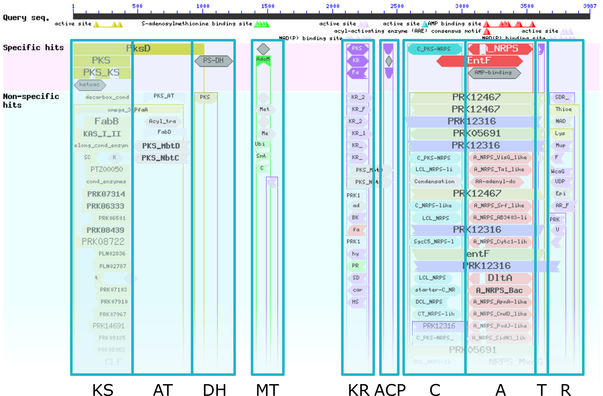
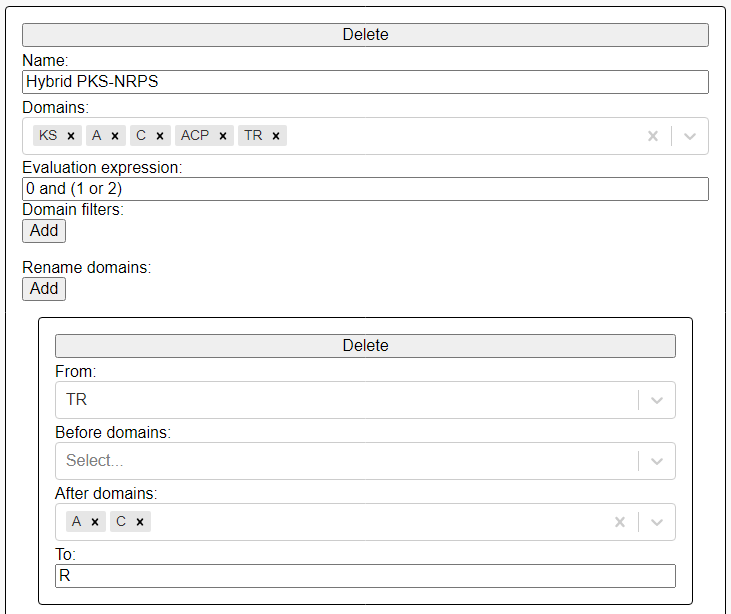
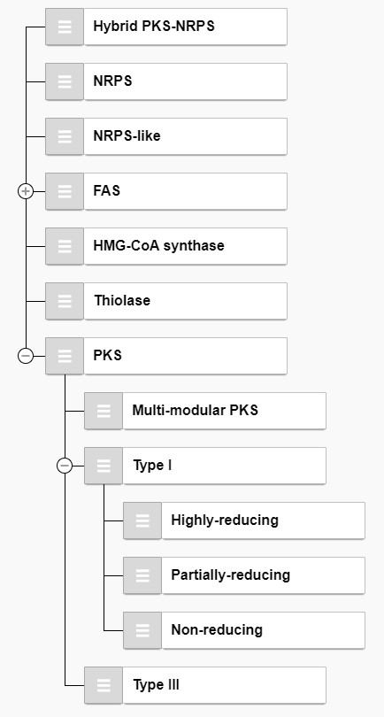

Creating custom rule sets
=========================

synthaser uses a central rule file which controls which domains it will save in domain
architecture predictions, as well as how sequences get classified based on those domain
architectures.

The default rule file distributed in the package is meant for the analysis of fungal
megasynthases (polyketide synthases, fatty acid synthases and nonribosomal peptide
synthetases). However, this can be repurposed for the analysis of any other multidomain
protein very easily using our `web application`__.

__ https://gamcil.github.io/synthaser/

What follows is a brief description of how synthaser uses the rule file at the various
stages of its workflow.

Identifying domain 'islands'
----------------------------

The problem synthaser aims to solve is best demonstrated in the following image:

This is the result of a CD-Search run using a hybrid polyketide synthase-nonribosomal
peptide synthetase sequence as a query. Within this visualisation, you can see all of
the domain hits found in the sequence during the search, as well as their positions
within the sequence.

These domain hits very clearly fall into distinct 'islands' (indicated by blue boxes)
with other, related domain hits. In this image, the domain islands correspond to the
domain architecture of the synthase, ``KS-AT-DH-MT-KR-ACP-C-A-T-R``.

While this is easy to figure out manually by looking at the visualisation, we often want
to analyse larger numbers of these sequences (e.g. when looking at full fungal
genomes), which quickly makes this manual approach prohibitive. This is where synthaser
comes in.

Creating domain types
---------------------

The first element of the synthaser rule file is the list of domain 'types' that we
want synthaser to find in the CD-Search results. Each domain type is given a
name as well as a list of specific domain families which correspond to the type.

Thinking back to the domain islands example above, we may wish to create a domain type
called `KS`, which consists of the domain families `PKS` and `PKS_KS` (the top-scoring
domain families in the search). This would indicate to the synthaser that whenever it
finds hits for either `PKS` or `PKS_KS` domains, they should be saved and categorised
as `KS` domains.

These can be edited in the leftmost pane in the web application:

.. image:: ../_static/webapp_left.png
  :width: 300
  :alt: Domain types pane in the synthaser web application

As mentioned, we first give the domain type a name (e.g. `C`), then we choose a list of
specific domain families (e.g. `C_PKS-NRPS`, `Condensation`). You can directly search for
families in this box by accession or name.

Creating classification rules
-----------------------------

Once synthaser has identified the domains in a query sequence and predicted its domain
architecture, the next task is classification. As with the domain identification step,
while we can easily determine domain architecture directly from the visual output
and tell what type of synthase we have, the difficulty comes when we want to analyse
more than a single sequence at a time.

These can be edited in the `Classification rules` pane of the web application:

This picture shows the rule for classifying a PKS-NRPS sequence. It consists of:

1. A name, given to a sequence when the rule is evaluated succesfully (`Hyrid
   PKS-NRPS`).
2. A list of domain types chosen from a multi-selection box populated by domain types
   created in the `Domain types` pane (`KS`, `A`, `C`, `ACP`, `TR`).
3. An evaluation expression which checks for presence of key domains for this rule
   (0 for `KS`, 1 for `A` and 2 for `C`). This rule will be satisfied if a sequence
   has a `KS` domain **AND** either an `A` **OR** `C` domain.
4. A renaming rule which specifies that a domain type should be renamed in a specific
   circumstance due to convention (a `TR` domain, if found after a `C` or `A` domain, is
   renamed to `R`).

The only thing this rule does not have is domain filters, which would control the
specific domain families that should be saved for a domain type. In the fungal ruleset,
this is key to being able to distinguish between `KS` domains from fatty acid synthases
and polyketide synthases, for example.

Classification rule evaluation hierarchy
----------------------------------------

Once you have established all of your classification rules, you need to define the order
in which they should be evaluated. This can be done in the `Rule hierarchy` pane:

This list is automatically populated by the rules that you created in the
`Classification rules` pane; by default, they will all be on the same evaluation level.

Rules are evaluated in top-to-bottom order according to this hierarchy.
They can be rearranged by simply clicking and dragging the grey handle to the left of
the rule name and dropping them where you want them. This could simply mean reordering
rules on the same level (e.g. moving `NRPS` before `Hybrid PKS-NRPS`), or making certain
rules children of others (e.g. if the `PKS` rule is successfully evaluated, only then
does synthaser try to evaluate the `Type I` rule). synthaser supports arbitrary levels
of nesting.

Using the rule file
-------------------

Once you're happy with your rule set, click the `Save rules` button in the top-right of
the web application. This wll download a JSON format file containing the domain types,
classification rules and hierarchy, that you can pass directly to synthaser for it to
use instead of the fungal ruleset.

For example, given a custom rule file, ``my_ruleset.json``:

``synthaser search -qf sequences.fa --rule_file my_ruleset.json``

If you ever want to modify your rule set, this can also be done in the web application
by loading your rule file with the ``Load rules`` button, making your tweaks, then
clicking ``Save rules`` to generate a new file.
